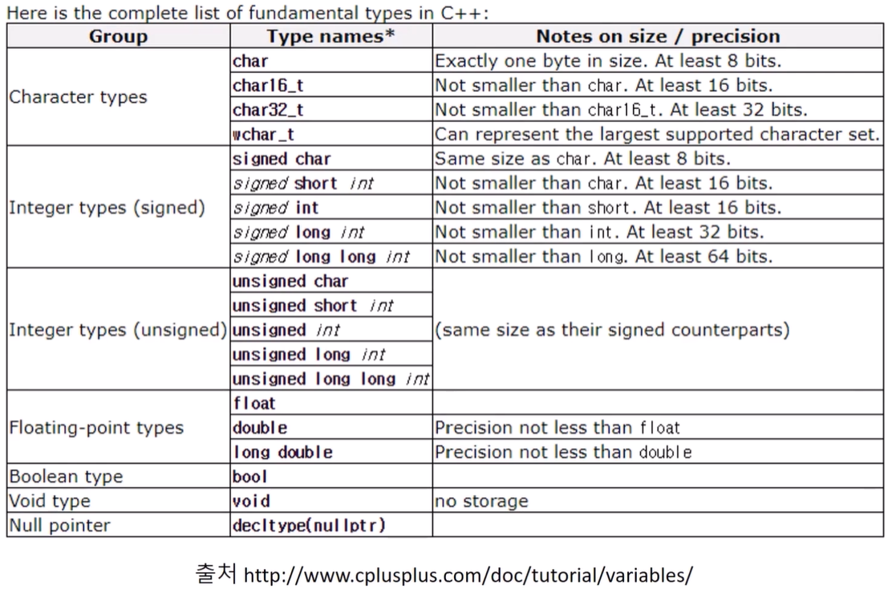
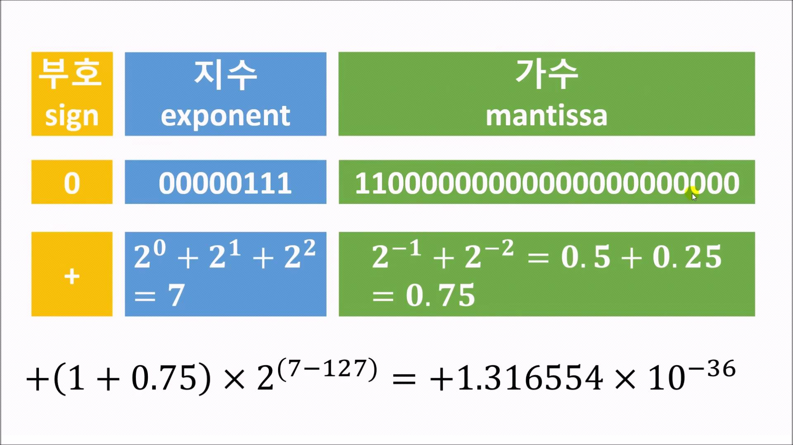

# 섹션 3. 변수와 기본 자료형

## 📝 핵심 개념 정리
1바이트 8비트. 4바이트면 32비트

signed int는 음,양의 정수, 0<br>unsigned는 양의 정수와 0
## 💻 코드 스니펫
```cpp
    int c, d, e;
    int j = 3;
    // int j(3); direct initialization
    // int j{ 3 } uniform initialization
    int p = (int)3.1415; // copy initialization
    //int p(3.14); //warning C4244: 'initializing': conversion from 'double' to 'int' 경고 뜨지만 컴파일은 됨 3으로 바꾸면서 짤림.
    //int p{ 3.14 }; //error C2397: conversion from 'double' to 'int' requires a narrowing conversion 아예 애러. 더 엄격
```
```cpp
#include <iostream>
#include <cmath>
#include <limits>

int main()
{
	using namespace std;

	short	s = 1; // 2 bytes = 2* 8 bits = 16 bits
	short	d = 1;
	int		i = 1;
	long l = 1;
	long long ll = 1;
	unsigned int j = -1; // 알아서 바꿔줌. overflow 됨

	cout << j << endl; // 4294967295

	cout << std::pow(2, sizeof(short) * 8 - 1) - 1 << endl; // short가 표현 할 수 있는 가짓 수 / 부호 자리 제외/ 0 제외
	cout << std::numeric_limits<short>::max() << endl; // 32767
	cout << std::numeric_limits<short>::min() << endl; // -32768
	cout << std::numeric_limits<short>::lowest() << endl; // -32768

	cout << std::numeric_limits<long>::max() << endl; // 2147483647
	cout << std::numeric_limits<long>::min() << endl; // -2147483648
	cout << std::numeric_limits<long>::lowest() << endl; // -2147483648

	cout << std::numeric_limits<long long>::max() << endl; // 9223372036854775807
	cout << std::numeric_limits<int>::max() << endl; // 2147483647
	cout << std::numeric_limits<unsigned int>::max() << endl; // 4294967295 부호 자리 할당 안 해서 더 많음


	s = 32767;
	s = s + 1; // 32768?

	cout << "32768? " << s << endl; // -32768이 나옴 overflow

	d = std::numeric_limits<short>::min();
	d = d - 1; // -32769?
	cout << "-32769? " << d << endl; // 32767이 나옴 overflow


	cout << sizeof(short) << endl;
	cout << sizeof(int) << endl;
	cout << sizeof(long) << endl;
	cout << sizeof(long long) << endl;


	int n = 22 / 4;
	cout << n << endl;
	cout << 22 / 4 << endl; // 정수끼리의 연산은 정수로
	cout << (float)22 / 4 << endl; // 22를 float로 바꿈. 둘중 하나를 float로 바꾸면 float로 나옴.

	return 0;
}

```
```cpp
#include <iostream>
//#include <cstdint> // iostream에서 인클루드 해줌

int main()
{
    using namespace std;

    std::int16_t i(5); // 2 bytes
    std::int8_t myint = 65; // char A

    cout << myint << endl;

    std::int_fast8_t fi(5);
    std::int_least64_t fl(5);

}

```
```cpp
int main()
{
    //void my_void; // 사이즈가 지정되지 않아서 쓰면 애러남
    int i = 123;
    float f = 123.456f;

    void *my_void;

    my_void = (void*)&i; // 각각의 데이터 타입의 첫 주소의 규격은 동일 어떤건 301호 어떤건 401호~408호 여도 첫 주소 규격은 일치함
    my_void = (void*)&f; // 주소를 표현하는 데이터의 양은 같다! 그래서 둘다 void*로 캐스팅(형 변환) 할 수 있음


    return 0;
}
```

```cpp
#include <iostream>
#include <iomanip>
#include <limits>
#include <cmath>

int main()
{
    using namespace std;

    double d(0.1);
    double d1(1.0);
    double d2(0.1 + 0.1 + 0.1 + 0.1 + 0.1 + 0.1 + 0.1 + 0.1 + 0.1 + 0.1);

    cout << d << endl; // 0.1
    cout << d1 << endl; // 1
    cout << d2 << endl; // 1
    cout << std::setprecision(17);
    cout << "---------------------" << endl;
    cout << d << endl; // 0.10000000000000001
    cout << d1 << endl; // 1
    cout << d2 << endl; // 0.99999999999999989

    float f(3.141592f); // 3.14159로 변환됨
    float s(123456789.0f); // 10 significant digits 유효숫자 10개
    cout << 31.4e-1 << endl;
    cout << std::setprecision(16);
    cout << 1.0 / 3.0 << endl;
    cout << s << endl; // 123456792
    cout << "---------------------" << endl;

    double zero = 0.0;
    double posinf = 5.0 / zero;
    double neginf = -5.0 / zero;
    double nan = zero / zero;

    cout << posinf << " " << std::isinf(posinf) << endl; // inf 1
    cout << neginf << " " << std::isinf(neginf) << endl; // -inf 1
    cout << nan << " " << std::isnan(nan) << endl; // -nan(ind) 1
    cout << 1.0 << " " << std::isnan(1.0) << endl;

    return 0;
}

```
```cpp
    using namespace std;

    cout << std::boolalpha;
    cout << isEqual(1, 1) << endl;
    cout << isEqual(0, 3) << endl;


    bool b1 = true; // copy initialization
    bool b2(false); // direct initialization
    bool b3{ true }; // uniform initialization
    b3 = false;

    cout << b3 << endl;
    cout << b1 << endl;

    //cout << std::noboolalpha;
    //cout << !true << endl; // not operator
    //cout << !false << endl;
    //cout << (true && true) << endl;
    //cout << (true && false) << endl;
    //cout << (false && true) << endl;
    //cout << (false && false) << endl;
```
```cpp
    if (false)
    {
        cout << "This is true " << endl;
        cout << "True second line " << endl;
    }
    else
        cout << "This is false" << endl;

    int n = 0;

    cin >> n;
    if (n % 2 == 0)
        cout << "This is even" << endl;
    else
        cout << "This is odd" << endl;

```
```cpp
    char c3(65);
    cin >> c3; //abc 이렇게 입력하면 버퍼에 저장되서 순차적으로 됨
    cout << c3 << " " << static_cast<int>(c3) << endl;

    cin >> c3;
    cout << c3 << " " << static_cast<int>(c3) << endl;

    cin >> c3;
    cout << c3 << " " << static_cast<int>(c3) << endl;

    // abc
		// a 97
		// b 98
		// c 99

		// 2개만 먼저 입력하면:
		// ab
		// a 97
		// b 98
		// c
		// c 99
```
```cpp
    cout << int('\n') << endl; // 10
    // \n과 endl의 차이: \n 는 단순히 줄바꿈이지만 endl은 cout 버퍼에 있는 걸 다 출력하고 줄바꿈하라
    // std::flush는 줄바꿈 안하고 버퍼에 있는걸 다 출력하라.
    // \t는 tab. "출력하고 싶으면 \" //   \a 는 소리
    cout << "line change test \nnice";

    // wchar_t l; //리눅스에서 쓴다고 함
    // char16_t char32_t 도 있음
```
```cpp
	float pi = 3.14f;
	int i = 1234; // 캐스팅 안하고 -1234u나 1234U하는 경우도 있음

	//Decimal : 0 1 2 3 4 5 6 7 8 9
	//Octal	  : 0 1 2 3 4 5 6 7
	//Hexa	  : 0 1 2 3 4 5 6 7 8 9 A B C ...

	int x = 012; // 8진수
	cout << x << endl; // 10
	int y = 0xF; // 16진수
	cout << y << endl;
	int z = 0b1010'1010; // 2진수 ' 기호 컴파일러가 무시해줌
	cout << z << endl;
```
## 🔥 헷갈린 것들 / 질문
- cout \<\< (float)22 / 4 \<\< endl; 그럼 double을 float로 나누면 double이 나오나?
## ✅ 복습 체크
- [ ] 강의 완주
- [ ] 코드 직접 따라 침
- [ ] 복습 1회
