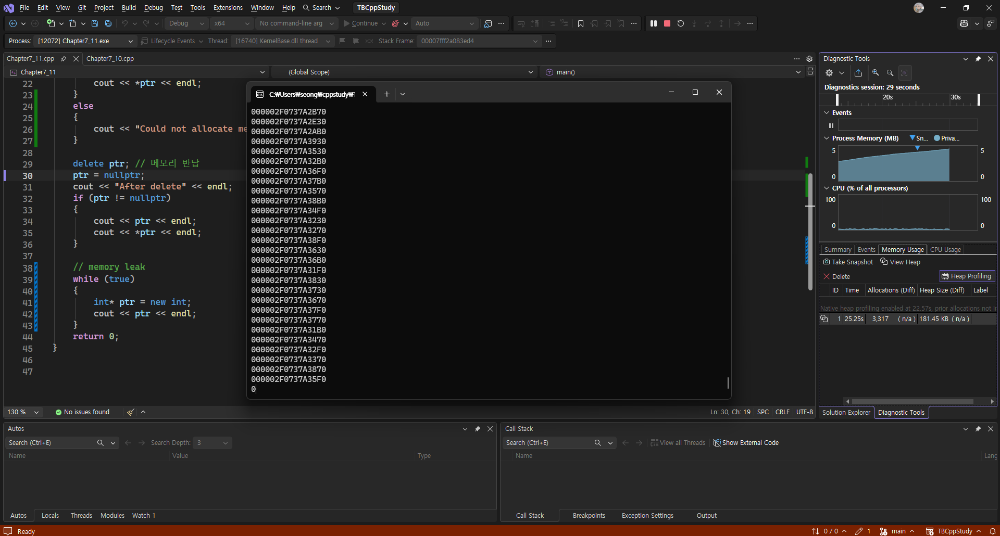
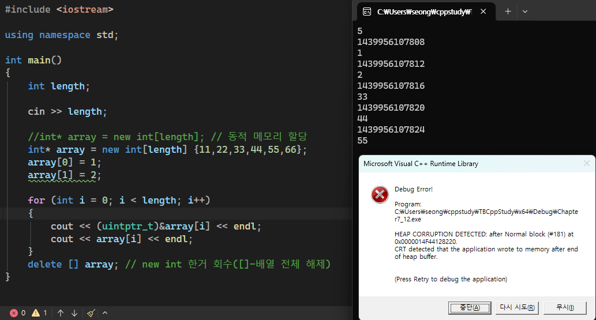

# 섹션 7. 행렬, 문자열, 포인터, 참조

## 📝 핵심 개념 정리
### 배열
    int my_array\[5\] = \{ 1,2,3,4,5 \};<br>    int my_array\[\] = \{ 1,2,3,4,5 \};<br>    int my_array\[\]\{ 1,2,3,4,5 \};<br>전부 동일.
int num_students = 0;<br>cin \>\> num_students;<br><br>// int students_scores\[num_students\]; // 런타임에서 사이즈가 고정된 곳에는 array를 사용할 수 없다<br>// 하고 싶으면 일단 cin 안하고 const int num_student = 5; 이런식으로 가능
```cpp
void doSomething(int student_scores[20]) // int student_scores[20] 이건 문법상 포인터. 배열이 아님
{
    cout << &student_scores << endl; // 포인터 변수의 주소가 나옴. 넘겨 받은 배열의 첫번째 주소값을 저장해둔 곳
    cout << &student_scores[0] << endl; // 이건 동일하게 나옴.
}

int main()
{
    const int num_students = 20;
    int student_scores[num_students] = {1, 2, 3, 4, 5, };

    cout << student_scores << endl; // 배열(식별자,인식자) 이름 자체가 주소로 사용되기 때문에 & 안붙여도 동일

    doSomething(student_scores); // 배열의 모든 원소를 통째로 가져오는게 아니라 첫번째 주소값만 복사
     return 0;
}
```
포인터는 왜 쓸까?
	→ 1. array에서 첫 번째 주소랑 데이터 몇개가 있다 정도를 알려주면 효율적임
	1. 변수를 자체로 여기저기서 쓸때 매번 변수 전체를 복사할 필요가 없어짐
```cpp
int main()
{
    int x = 5;
    double d = 123.0;

    int* ptr_x = &x, * ptr_y = &x;
    double* ptr_d = &d;

    cout << sizeof(x) << endl;  // 4
    cout << sizeof(d) << endl;  // 8
    cout << sizeof(&x) << " " << sizeof(ptr_x) << endl; // 8 8
    cout << sizeof(&d) << " " << sizeof(ptr_d) << endl; // 8 8
```
집이 크다고 해서 주소가 길지는 않다.
널 포인터(null pointer)
```cpp
    double *ptr = 0; // c-style
    double* ptr = NULL; // c-style
    double* ptr = nullptr; // mpdern c++
    double* ptr{ nullptr }; // mpdern c++
```
```cpp
if (ptr != nullptr)
{
    //do something useful
    std::cout << *ptr << std::endl;
}
else
{
    //do nothing with ptr
    std::cout << "NULL ptr, do nothing" << std::endl;
}
```
```cpp
std::nullptr_t nptr; //nullptr 값만 넣을 수 있음
```
---
```cpp
void printArray(int array[]) // int *array 같음
{
    cout << sizeof(array) << endl;
    *array = 100; // 함수 밖에서도 바뀜
}
```
```cpp
int main()
{

    int array[5] = { 9,7,5,3,1 };

    cout << array << endl;
    cout << &array[0] << endl; // array 랑 같음. array는 사실상 포인터

    int *ptr = array;
    cout << "size : " << sizeof(ptr) << endl;
    cout << ptr << endl;
    cout << *ptr << endl;

    printArray(array); // 20아니고 8나옴. 함수 안에서도 내부적으로는 포인터.
    cout << *array << endl;

    return 0;
}
```
main 밖 함수에서 \*array를 수정하였기 때문에 메인의 array\[0\] 바뀜. 배열 시작점 메모리에 접근해서 변경.

```cpp
    while (true)
    {
        int* ptr = new int;
        cout << ptr << endl;
        //delete ptr;

    }
```
만들고 안 지원서 메모리 누수

5개 할당했는데 6개 넣음. 메모리 충돌로 애러.
```cpp
#include <iostream>

int main()
{

    int value1 = 5;
    const int *ptr = &value;

    int value2 = 6;
    ptr = &value2;

    return 0;
}
```
const int \*ptr 는 포인터 경로를 통해서는 가리키고 있는 값을 수정 할 수 없다. <br>즉, \*ptr = 6; 같은 것은 안되지만 value1 = 6; 로 변수 이름을 통한 변경이나 ptr = &value2; 같이 다른 주소를 가리키게 하는 것은 가능.
```cpp
    int value3 = 5;
    int *const ptr1 = &value3;

    *ptr1 = 10;
    cout << *ptr1 << endl;

    int value4 = 8;
    ptr1 = &value4;
```
위에 것은 불가능함. 진짜 포인터 주소 값은 못바꾸는 상수.
```cpp
    int value5 = 5;
    const int* const ptr2 = &value5;
```
이건 변수 이름으로 값을 바꾸는 거랑 다른 주로를 가리키게 하는 거 모두 불가능.
```cpp
int value = 5;
const int *ptr1 = &value;
int *const ptr2 = &value;
const int *const ptr3 = &value;
```
```cpp
int value = 5;
int &ref = value;
cout << ref << endl; // 5

ref = 10;
cout << value << " " << ref << endl; // 10 10
```
레퍼런스는 자기 자신의 주소를 갖고 있지 않음. 변수의 주소를 공유함.<br>그래서 초기화가 무조건 필요하며 L-value로만 할 수 있음. (int &ref = 123; 같은 건 불가능)(리터럴은 메모리 주소를 갖을 수 없음)
```cpp
    const int y = 8;
    int &ref = y;
```
위와 같은건 불가능. 레프에서 y의 값을 바꿔버릴 수도 있기 때문. 하고 const int &ref = y 로 해야함
```cpp
void doSomething2(int &n) // 레퍼런스로 받음
{
    n = 10;
    cout << &n << " In do something" << " " << n << endl;
}

int n = 5;
doSomething2(n); // 레퍼런스로 넘겼기 때문에 변수 자체가 넘어가기 때문에 주소조차도 복사 할 필요가 없음, 실행 후 값 바뀜
```
함수에서 값 못 바꾸게 하려면 void doSomething2(const int &n)<br>
```cpp
struct Something
{
    int v1;
    float v2;
};

struct Other
{
    Something st;
};
```
```cpp
    Other ot;
    //ot.st.v1 = 1.0; // 비효율
    int &v1 = ot.st.v1;
    v1 = 1;
```
처럼 구조체도 레퍼런스로 편하게 접근 가능.
```cpp
int value = 5;

int *const ptr = &value;
int &ref = value;

*ptr = 10;
ref = 10;
```
기능상 동일함.
<br>const int &ref_x = 5; // const 레퍼런스는 리터럴로 초기화 가능. 주소도 나옴
**For-each 반복문**
```cpp
#include <iostream>

using namespace std;

int main()
{
    const int fibonacci[] = { 0,1,1,2,3,5,8,13,21,34,55,89 }; // 파이선 스러워짐

    for (int number : fibonacci)
        cout << number << " ";
    cout << endl;

    return 0;
}
```
array 동적 할당한 for-each
---
<br>**void pointer 혹은 generic pointer**
```cpp
int i = 5;
float f = 3.0f;
char c = 'a';

void* ptr = nullptr;

ptr = &c;
ptr = &i;
ptr = &f;

//cout << ptr + 1 << endl; // void 포인터는 이거 못 씀, +1 할때 몇 바이트를 더해야 할 지 알 수 없음.

cout << &f << " " << ptr << endl;
//cout << *ptr << endl; // 무슨형이 있는지 알 수 없으므로 디 레퍼런싱 불가능
cout << *static_cast<float*>(ptr) << endl;
```
---
**이중포인터**
```cpp
    const int row = 3;
    const int col = 5;

    const int s2da[row][col] =
    {
        {1,2,3,4,5},
        {6,7,8,9,10},
        {11,12,13,14,15}
    };

    int *r1 = new int[col] {1, 2, 3, 4, 5};
    int *r2 = new int[col] {6, 7, 8, 9, 10};
    int *r3 = new int[col] {11, 12, 13, 14, 15};

    int **rows = new int* [row] {r1, r2, r3};

    for (int r = 0; r < row; ++r)
    {
        for (int c = 0; c < col; c++)
            cout << rows[r][c] << " ";
        cout << endl;
    }
```
rows\[1\]\[2\] 가 바로 8로 됨. <br>→  대괄호 하나를 벗길 때마다 `*(포인터 + 인덱스)`로 바뀜
```cpp
p[i] == *(p + i)
```
```cpp
int **rows = new int*[3] { r1, r2, r3 };
```
메모리 구조는 대략:
```plain text
rows
 ↓
┌────┬────┬────┐
│ r1 │ r2 │ r3 │   각 원소의 자료형은 int*
└────┴────┴────┘
       ↓
      {6, 7, 8, 9, 10}
```
따라서:
```plain text
rows[1]
== *(rows + 1)
== r2
```
자료형의 변화를 따라가면 더 명확
```plain text
rows         // int**
rows + 1     // int** : 두 번째 int* 칸의 주소
*(rows + 1)  // int*  : 그 칸에 저장된 r2
```
2차원 첨자도 같은 규칙을 두 번 적용
```plain text
rows[1][2]
== *(rows[1] + 2)
== *(*(rows + 1) + 2)
== 8
```
```cpp
#include <iostream>
#include <array>
#include <algorithm>

...

array<int, 5> my_arr = { 1,21,3,40,5 };
//cout << my_arr.at(10) << endl; // 미리 해보고 문제 생기면 예외처리.

for (auto& element : my_arr)
	cout << element << " ";
cout << endl;

std::sort(my_arr.begin(), my_arr.end());

for (auto& element : my_arr)
	cout << element << " ";
cout << endl;

std::sort(my_arr.rbegin(), my_arr.rend()); // 역순 정렬
```
```cpp
#include <iostream>
#include <vector>

using namespace std;

int main()
{
    std::vector<int> array2 = { 1,2,3,4,5 };
    cout << array2.size() << endl;

    std::vector<int> array4 { 1,2,3, };
    cout << array4.size() << endl;


    std::vector<int> arr = { 1,2,3,4,5 };

    for (auto &itr : arr)
        cout << itr << " ";
    cout << endl;

		cout << arr.size() << endl;
    cout << arr[1] << endl;
    cout << arr.at(1) << endl;

    return 0;
}
```
int \*my_arr = new int\[5\]; 랑 다르게 delete\[\] my_arr; 처럼 지워 줄 필요 없음.<br>벡터는 자동으로 사라져서 메모리 누수의 위험 없음. 메모리 관리 편함<br>동적 할당 쉬움. resize , size 등등 이미 구현되어 있음.
## 💻 코드 스니펫
```cpp
for (int i = 0; i < num_students; ++i)
{
    total_score += scores[i];
    //if (max_score < scores[i]) max_score = scores[i];
    max_score = (max_score < scores[i]) ? scores[i] : max_score;
}
```
```cpp
    int array[num_rows][num_coloums] = // row-major <-> column-major
    {
        {1,2,3,4,5}, //row 0
        {6,7,8,9,10}, //row 1
        {11,12,13,14,15} //row2
    };


    for (int row = 0; row < num_rows; ++row)
    {
        for (int col = 0; col < num_coloums; ++col)
            //cout << array[row][col] << '\t';
            cout << (int) & array[row][col] << '\t';

        cout << endl;

    }
```
```cpp
    char myString[] = "string"; // 문자열 맨 마지막에 null character(\0)가 있어서 7글자

    for (int i = 0; i < 7; ++i)
    {
        cout << (int)myString[i] << endl;
    }
    cout << sizeof(myString) / sizeof(myString)[0] << endl;

    char uString[255];
    //cin >> uString;
    cin.getline(uString, 255);
    //uString[4] = '\0'; // 4번 인덱스 부터 뒤로 생략
    cout << uString << endl;

    int ix = 0;
    while (true)
    {
        if (uString[ix] == '\0') break;

        cout << uString[ix] << " " << (int)myString[ix] << endl;
        ++ix;
    }

```
## 🔥 헷갈린 것들 / 질문
- cout \<\< '\[' \<\< row \<\< '\]' \<\< '\[' \<\< col \<\< ' \]' \<\< '\\t';
 ' \['는 공백(0x20)과 \](0x5D)라는 두 문자의 아스키 코드가 합쳐진 0x205D 라는 16진수 정수가 됨 <br>한참 찾았네.. 실수 주의.
```cpp
int main()
{
    const int value = 5;
    int *ptr = &value;

    return 0;
}
```
이건 왜 안될까? → \*ptr = 10; 같은 길이 열려 있기 때문에 위험 방지로 막아둠. const로 하고 싶으면 <br>const int \*ptr 로 해야 함.
```cpp
int main()
{
    int value = 5;
    const int *ptr = &value;

    value = 6; //이건 가능

    return 0;
}
```
```cpp
    Person person;

    person.age = 5;
    person.weight = 30;

    Person &ref = person;
    ref.age = 15;

    Person *ptr = &person;
    ptr->age = 30;
    //(*ptr).age = 20; // 가능은 하나 잘 안씀

    Person& ref2 = *ptr;
    ref2.age = 45;
```
- 포인터나 레퍼런스 왜 쓰는걸까?<br>→ 메모리와 성능 효율성. 함수에 인자 전달하거나 복사할때 값을 복사 하지 않고도 할 수 있음.<br>원본 데이터 수정도 가능함. 등등
- 스택과 힙의 차이는 무엇일까?<br>→
<table>
<tr>
<td>**구분**</td>
<td>**스택 (Stack)**</td>
<td>**힙 (Heap)**</td>
</tr>
<tr>
<td>**관리 주체**</td>
<td>컴파일러 / OS (자동)</td>
<td>프로그래머 (수동 또는 스마트 포인터)</td>
</tr>
<tr>
<td>**할당 시점**</td>
<td>컴파일 타임 \~ 함수 호출 시</td>
<td>런타임 (동적 할당)</td>
</tr>
<tr>
<td>**할당/해제 속도**</td>
<td>매우 빠름</td>
<td>상대적으로 느림</td>
</tr>
<tr>
<td>**메모리 크기**</td>
<td>작음 (보통 몇 MB 수준)</td>
<td>큼 (시스템 사용 가능한 RAM 크기)</td>
</tr>
<tr>
<td>**구조**</td>
<td>LIFO (연속적 메모리)(후입선출)</td>
<td>비연속적 (파편화 발생 가능)</td>
</tr>
<tr>
<td>**주요 에러**</td>
<td>Stack Overflow</td>
<td>Memory Leak, Double Free 등</td>
</tr>
</table>
## ✅ 복습 체크
- [x] 강의 완주
- [x] 코드 직접 따라 침
- [x] 복습 1회
