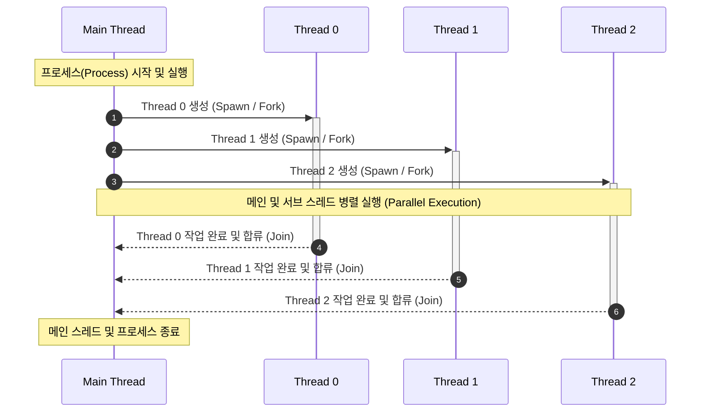

# 섹션 20. 모던 C++ 필수 요소들

## 📝 핵심 개념 정리
### **람다 함수와 std::function std::bind, for_each**
#### 람다 함수
```cpp
[capture](parameters) -> return_type { body }
```
```cpp
int a = 10;
auto add = [a](int x) { return a + x; };
```
- `[a]`: `a`를 값으로 복사
- `[&a]`: `a`를 참조
- `[=]`: 필요한 외부 변수를 기본적으로 값 캡처
- `[&]`: 필요한 외부 변수를 기본적으로 참조 캡처
`[]`에는 외부 변수를 가져오는 방식을, `()`에는 호출할 때 받을 인자를 적음
#### std::function
```cpp
std::function<반환타입(매개변수타입들)> 변수명 = 호출가능객체;
```
```cpp
std::function<void(int)> func =
	[](int n) { cout << n; };
```
함수랑 람다 담는 래퍼<br>콜백을 멤버 변수나 컨테이너에 저장해야 할 때 유용
#### std::bind
```cpp
auto add5 = std::bind(add, 5, std::placeholders::_1);
```
기존 함수의 일부 인자를 미리 고정하여 새로운 호출 가능 객체를 만듬. 현대 C++에서는 동작이 더 잘 드러나는 람다를 쓰는 경우가 많다.
```cpp
auto add5 = [](int x) {
    return add(5, x);
};
```
인자를 채우고 새 함수 만들기
#### for_each
```cpp
std::for_each(v.begin(), v.end(),
    [](int n) { cout << n; });
```
원소를 수정하려면 람다 매개변수를 참조로 받아야 한다.
```cpp
std::for_each(v.begin(), v.end(),
    [](int& n) { n *= 2; });
```
범위 내 원소에 함수를 일괄 적용
### 여러 개의 리턴값 반환하기
```cpp
#include <iostream>
#include <tuple>

using namespace std;

auto my_func()
{
    return tuple(123, 456, 789, 10);
}

int main()
{
    auto[a, b, c, d] = my_func();

    cout << a << " " << b << " " << c << " " << d << " " << endl;

    //auto result = my_func();
    //cout << get<0>(result) << " " << get<1>(result) << get<2>(result) << endl;

    return 0;
}
```
### **std thread와 멀티스레딩 기초**

```cpp
#include <iostream>
#include <string>
#include <thread>
#include <chrono>
#include <vector>
#include <mutex>

using namespace std;

int main()
{
    cout << std::thread::hardware_concurrency() << endl;
    cout << std::this_thread::get_id() << endl;

    const int num_pro = std::thread::hardware_concurrency();

    vector<std::thread> my_threads;
    my_threads.resize(num_pro);

    for (auto& e : my_threads)
        e = std::thread([]() {
        cout << std::this_thread::get_id() << endl;
        while (true) {}});

    for (auto& e : my_threads)
        e.join();

}
```
```cpp
    /*auto work_func = [](const string & name)
    {
        for (int i = 0; i < 5; ++i)
        {
            std::this_thread::sleep_for(std::chrono::milliseconds(100));

            cout << name << " " << std::this_thread::get_id() << " is working " << i << endl;
        }
    };

    work_func("JackJack");
    work_func("Dash");*/

    // 멀티스레딩
    auto work_func = [](const string & name)
    {
        for (int i = 0; i < 5; ++i)
        {
            std::this_thread::sleep_for(std::chrono::milliseconds(100));

            mtx.lock();
            cout << name << " " << std::this_thread::get_id() << " is working " << i << endl;
            mtx.unlock();
        }
    };

    std::thread t1 = std::thread(work_func, "JackJack");
    std::thread t2 = std::thread(work_func, "Dash");

    t1.join();
    t2.join();

    return 0;
```
### **레이스 컨디션, std::atomic, std::scoped_lock**
```cpp
#include <iostream>
#include <thread>
#include <atomic>
#include <mutex>
#include <chrono>

using namespace std;

mutex mtx;

int main()
{
/*    atomic<int> shared_memory(0);

    auto count_func = [&]() {
        for (int i = 0; i < 1000; ++i)
        {
            this_thread::sleep_for(chrono::milliseconds(1));
            //shared_memory++;
            shared_memory.fetch_add(1);
        }
    };*/

    int shared_memory(0);

    auto count_func = [&]() {
        for (int i = 0; i < 1000; ++i)
        {
            this_thread::sleep_for(chrono::milliseconds(1));

            //mtx.lock();

            //std::lock_guard lock(mtx);
            std::scoped_lock lock(mtx);
            shared_memory++;

            //mtx.unlock();

        }
    };

    thread t1 = thread(count_func);
    thread t2 = thread(count_func);


    t1.join();
    t2.join();

    cout << "After" << endl;
    cout << shared_memory << endl;

    return 0;
}
```
### **작업 기반 비동기 프로그래밍**
1. `std::thread`는 작업 결과를 공유 변수에 저장하고, `join()`으로 작업이 끝날 때까지 기다린다.
2. `std::async`는 작업을 실행하고 결과를 `std::future`로 돌려주며, `get()`은 완료를 기다린 뒤 값을 꺼낸다.
3. `std::promise`는 작업 스레드가 값을 전달하는 통로이고, 연결된 `future`가 그 값을 받는다.
```cpp
// async: 결과를 자동으로 future에 연결
auto async_result = std::async([] {
    return 1 + 2;
});
cout << async_result.get() << endl;

// promise: 결과를 직접 future에 전달
std::promise<int> promise;
std::future<int> future = promise.get_future();

std::thread worker(
    [](std::promise<int> p) {
        p.set_value(1 + 2);
    },
    std::move(promise)
);

cout << future.get() << endl;
worker.join();
```
### 멀티스레딩 예제 (백터 내적)
```plain text
std::inner_product
0.394621
3024730089

Naive
1.25716
967459247

Lockguard
6.59418
3024730089

Atomic
3.16206
3024730089

Future
0.147124
3024730089

std::transform_reduce
0.0270046
3024730089
```
### 완벽한 전달과 std::forward
```cpp
#include <iostream>
#include <vector>
#include <utility> // std::forward

using namespace std;

struct MyStruct
{};

void func(MyStruct& s)
{
	cout << "Pass by L-ref" << endl;
}

void func(MyStruct&& s)
{
	cout << "Pass by R-ref" << endl;
}


template<typename T>
void func_wrapper(T&& t)
{
	func(std::forward<T>(t));
}

int main()
{
    MyStruct s;

	func_wrapper(s);
	func_wrapper(MyStruct());

	return 0;
}
```
### 자료형 추론 auto와 decltype
1. auto는 초기화 값으로 타입을 추론하며 기본적으로 const와 참조(&)를 제거하지만, auto&나 포인터 형태에서는 const가 유지됨
2. decltype은 식을 실제로 실행하지 않고 컴파일 타임에 타입을 그대로 추출하여 const와 참조(&) 속성을 온전히 보존
3. decltype((변수))처럼 이중 괄호나 L-value 식에는 참조(&)가 덧붙으므로, 순수 값 타입이 필요할 땐 std::remove_reference를 함께 활용
## 💻 코드 스니펫
```cpp
// 직접 따라 친 코드 중 기억할 것
```
## 🔥 헷갈린 것들 / 질문
-
## ✅ 복습 체크
- [x] 강의 완주
- [x] 코드 직접 따라 침
- [ ] 복습 1회
